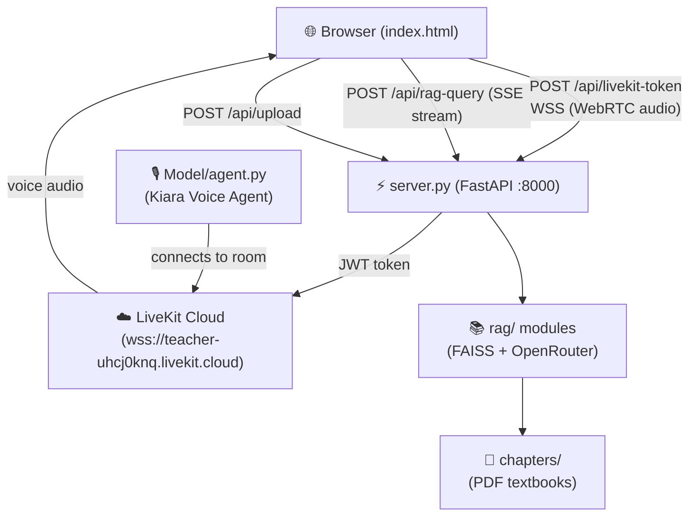

# ✅ AI Teacher — Centralized UI Walkthrough

## What Was Built

Three new files at `d:\AI Teacher\`:

| File | Purpose |
|---|---|
| [server.py](file:///d:/AI%20Teacher/server.py) | FastAPI bridge between LiveKit agent & RAG pipeline |
| [index.html](file:///d:/AI%20Teacher/index.html) | Child-friendly single-page UI for Class 1–5 students |
| [requirements.txt](file:///d:/AI%20Teacher/requirements.txt) | Combined Python dependencies |

---

## Architecture



---

## How to Run

### Step 1 — Start the LiveKit Voice Agent
Open a terminal in `d:\AI Teacher\Model\`:
```powershell
python agent.py dev
```
> Kiara will join the `kiara-classroom` LiveKit room automatically.

### Step 2 — Start the Web Server
Open a second terminal in `d:\AI Teacher\`:
```powershell
python -m uvicorn server:app --port 8000 --reload
```

### Step 3 — Open the UI
Visit **[http://localhost:8000](http://localhost:8000)** in Chrome or Edge.

---

## UI Features

| Feature | Description |
|---|---|
| 🏫 Class Selector | Coloured grade cards (Class 1–5) that update Kiara's answer complexity |
| 📚 Subject Selector | Rainbow pill buttons for 7 subjects |
| 🎙️ Voice Panel | Click mic → browser joins LiveKit room → talk live to Kiara |
| 💬 RAG Chat | Type questions → answers stream in token-by-token via SSE |
| 📄 PDF Upload | Drag-and-drop textbook → embedded and ready in seconds |
| 📖 Quick Load | One-click load for PDFs already in [chapters/](file:///d:/AI%20Teacher/server.py#110-117) folder |
| ⭐ Star Reward | Stars awarded for uploads, loads, and correct answers |

---

## Verification Results

| Check | Result |
|---|---|
| `GET /` (serves UI) | ✅ `200 OK` |
| `GET /api/chapters` | ✅ `{"chapters":["test.pdf"]}` |
| `POST /api/livekit-token` | ✅ Valid JWT returned |
| Server startup | ✅ No errors, no import failures |
| [faiss_manager.py](file:///d:/AI%20Teacher/rag/vector_store/faiss_manager.py) import | ✅ Fixed deprecated `langchain` → `langchain_community` |
